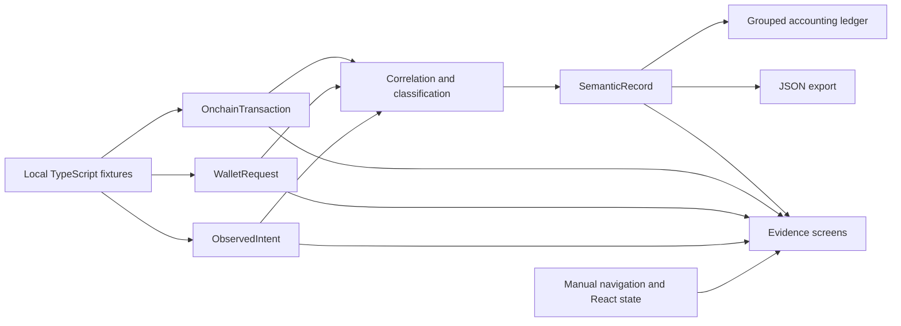

# IntentLedger

**Capture DeFi intent before it gets lost in the transaction.**

IntentLedger connects what users intended, what wallets signed, and what blockchains executed — producing structured semantic records for DeFi accounting.

Built as an interactive prototype for a **Colosseum hackathon**, it demonstrates how preserving context at the point of interaction can help accounting tools classify DeFi activity across protocols and chains.

**Prototype at a glance:** 4 user actions · 7 transactions · 4 protocols · Ethereum + Solana.

The application runs entirely in the browser and can be hosted on GitHub Pages. No wallet connection, extension installation, backend, database, authentication, API key, or external RPC service is required.

> **Prototype scope:** All blockchain transactions, addresses, execution results, and evidence relationships are local fixtures. The application demonstrates the proposed workflow; it does not capture live dApp activity, sign transactions, or move funds.

## The problem

A DeFi interface knows whether a user is swapping tokens, bridging assets, depositing into a lending reserve, or adding liquidity. That context can disappear after the transaction is submitted.

An accounting tool later sees contract interactions and token movements. It must reconstruct which movements belong together and what they mean. Cross-chain activity makes this especially difficult: an outgoing transfer on Ethereum and an incoming transfer on Solana can appear to be unrelated transactions that need manual review.

## The solution

IntentLedger preserves the connection between four layers:

1. **Observed intent:** What the user asked the dApp to do.
2. **Wallet request:** What the dApp sent to the wallet.
3. **Onchain execution:** What the transaction actually executed, including results on another chain.
4. **Semantic record:** A structured accounting interpretation with the supporting evidence attached.

The intended outcome is fewer manual classification exceptions and a traceable explanation for each accounting action. This prototype demonstrates that outcome using deterministic fixtures; it does not measure production accuracy or time savings.

## Try the prototype

Start the application using the local setup below, then follow the Mayan example:

1. Click **View accounting ledger** or **Explore captured actions**.
2. Inspect the two independently listed transactions: **1,000 USDC outgoing on Ethereum** and **998.4 USDC incoming on Solana**. They are marked **Needs manual review**.
3. Click **Capture the intent** to inspect the user's request to bridge 1,000 USDC through Mayan Finance.
4. Click **View wallet request**, then **Follow execution**, to inspect the request and both confirmed fixture transactions.
5. Click **Generate semantic record**. The result describes one `BRIDGE` action, with UI, wallet, and execution evidence attached.
6. Click **Apply to accounting ledger**. The two transactions become one grouped entry marked **Automatically classified**.
7. Inspect the before/after comparison, or open the record and use **Export JSON** or **Copy**.

Use the sidebar to explore Jupiter, Kamino, and Raydium. Evidence tabs let you move between layers at your own pace. All navigation is manual; there is no automated playback. Classification state is preserved while navigating and resets when the page is refreshed.

## Supported scenarios

| Protocol      | Semantic action | Requested action and execution result                                        | Transactions |
| ------------- | --------------- | ---------------------------------------------------------------------------- | ------------ |
| Mayan Finance | `BRIDGE`        | Bridge 1,000 USDC from Ethereum to Solana; receive 998.4 USDC                | 2            |
| Jupiter       | `SWAP`          | Swap 5 SOL; receive 712.83 USDC with a 0.50% slippage tolerance              | 1            |
| Kamino        | `DEPOSIT`       | Supply 1,000 USDC; receive 985.22 kUSDC receipt units and a lending position | 2            |
| Raydium       | `ADD_LIQUIDITY` | Supply 500 USDC + 3.5 SOL; receive 41.82 LP units                            | 2            |

Mayan is the initial unresolved exception. The other three actions are pre-classified so reviewers can inspect additional examples. Classifying Mayan reduces unresolved exceptions from **1 to 0**.

The examples also illustrate different accounting challenges: requested versus received amounts, resulting DeFi positions, setup transactions, and multiple token movements belonging to one user action.

## Semantic output

The Mayan record contains a human-readable summary:

> Bridged 1,000 USDC from Ethereum to Solana via Mayan Finance and received 998.4 USDC.

Its structured fields include the action, protocol, origin, source and destination chains, requested and received amounts, transaction references, status, confidence, and evidence. The full JSON export also includes the observed intent, wallet request, and all linked transactions.

Evidence badges show **UI Observed**, **Wallet Request Matched**, **Source Tx Confirmed**, and **Destination Tx Confirmed**. `HIGH` confidence means the expected evidence is present in this fixture. It is not a claim of independently verified execution or production classification accuracy.

## Local development

Use **Node.js 24** and npm. The tests use Node's built-in TypeScript support.

From the repository root containing this README and `package.json`:

```sh
npm ci
npm run dev
```

Open the URL printed by Vite, usually `http://localhost:5173/`.

```sh
npm test               # Classification and manual React DOM interaction tests
npm run typecheck      # Strict TypeScript and unused-code checks
npm run build          # Type-check and build the static site into dist/
npm run test:pages     # Verify built assets resolve under a repository subpath
npm run format:check   # Check code formatting
npm run preview        # Preview the production build
```

To preview a GitHub Pages-style repository subpath:

```sh
npm run build
npm run preview -- --base /intentledger/ --port 4173
```

Open `http://localhost:4173/intentledger/`.

## Architecture

The application uses **React, TypeScript, and Vite**, with local CSS and bundled icons. Application state stays in memory. Runtime behavior does not depend on external services.



| File                           | Responsibility                                                                      |
| ------------------------------ | ----------------------------------------------------------------------------------- |
| `src/types.ts`                 | Domain models and the `LedgerProvider` interface for future data sources            |
| `src/fixtures.ts`              | Four local scenarios and the `fixtureProvider` adapter                              |
| `src/domain.ts`                | Evidence correlation and semantic record generation                                 |
| `src/App.tsx`                  | Application state, manual navigation, and applying classification results           |
| `src/screens/`                 | Dashboard, accounting ledger, intent, wallet request, execution, and record screens |
| `src/components/ui.tsx`        | Shared badges, protocol marks, and evidence display components                      |
| `src/styles.css`               | Responsive layout, transitions, and reduced-motion support                          |
| `vite.config.ts`               | React configuration and centralized relative asset base                             |
| `tests/`                       | Domain, manual interaction, and GitHub Pages asset tests                            |
| `.github/workflows/deploy.yml` | Checks, production build, and GitHub Pages deployment                               |

The UI currently consumes bundled fixtures synchronously. `LedgerProvider` and `fixtureProvider` define a boundary for future asynchronous data sources; RPC adapters are not implemented. The current correlation logic checks shared intent/request identifiers, wallet context, and chain references in the fixtures.
