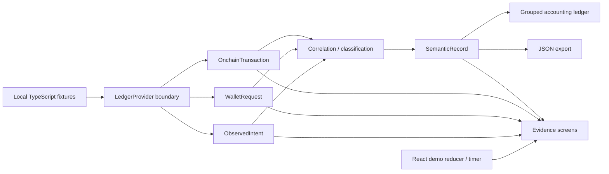

# IntentLedger

**Capture DeFi intent before it gets lost in the transaction.**

DeFi の UI はユーザーが「何をしようとしているか」を知っています。しかし、後から取引を読む会計ソフトには、トークンの入出金しか見えないことがあります。IntentLedger は **UI の意図 → ウォレット要求 → オンチェーン実行 → 意味レコード** を関連付け、手動例外を減らすためのプロトタイプです。

React・TypeScript・Vite で実装した完全静的サイトです。バックエンド、DB、認証、API キー、ウォレット、拡張機能、外部 RPC は不要です。フォントとアイコンもローカルで提供します。

## シナリオ

| プロトコル | 操作 | 要求と結果 | 取引数 |
| --- | --- | --- | --- |
| Mayan Finance | BRIDGE | Ethereum 1,000 USDC → Solana 998.4 USDC | 2 |
| Jupiter | SWAP | 5 SOL → 712.83 USDC、スリッページ 0.50% | 1 |
| Kamino | DEPOSIT | 1,000 USDC 供給 → 985.22 kUSDC 受領単位・貸付ポジション | 2 |
| Raydium | ADD_LIQUIDITY | 500 USDC + 3.5 SOL → 41.82 LP units | 2 |

計 **4 actions / 7 transactions / 4 protocols / 2 chains**。初期状態では Mayan のみ未解決で、他の3操作は分類済みです。Mayan を処理すると未解決例外は 1 → 0 になります。「3 protocols」という例示値は4つの要求シナリオに合わせて修正しています。

すべての取引ハッシュ、署名、アドレス、契約・プログラム識別子、時刻、実行結果、関連付けは **demo fixtures** です。実チェーンとの照合や外部 Explorer へのリンクは行いません。Kamino の交換率や Raydium の LP 単位も説明用です。HIGH confidence は、この fixture の証拠が揃っていることを示し、本番の判定精度を主張するものではありません。

## ローカル実行

Node.js **24** を使用してください（テストは Node の TypeScript 対応で実行します）。この README のある `intentledger` ディレクトリをプロジェクトルートにします。

```sh
cd /Users/soya/myproject/solana-workshop/intentledger
npm ci
npm run dev
```

表示された URL（通常 `http://localhost:5173/`）を開きます。

```sh
npm test               # 分類・デモ状態 + React DOM 操作の回帰テスト
npm run typecheck      # TypeScript / 未使用コード検査
npm run build          # 型検査 + dist の本番ビルド
npm run test:pages     # ビルド済みアセットの相対パス検証
npm run format:check   # コード書式の検査
npm run preview        # 本番ビルドのプレビュー
```

Pages と同じサブパスで確認する場合:

```sh
npm run preview -- --base /intentledger/ --port 4173
```

`http://localhost:4173/intentledger/` を開いてください。

## デモ操作

- **Run Demo / Play Automated Demo**: Mayan の8段階ストーリーを約52秒で自動再生します。
- **Pause / Resume**: 現在の段階の経過時間を保持して停止・再開します。
- **Restart**: Mayan の未分類状態へ戻します。続けて Play を押して再生します。
- **Next step**: 次の段階へ進みます。一時停止中は停止を維持します。
- **Replay**: 完了後、リロードなしで未分類状態から再生し直します。
- サイドバーと証拠タブ: 各シナリオを手動で確認できます。手動ナビゲーションは自動再生を終了します。
- **Export JSON / Copy**: 意味レコードをダウンロード・コピーします。エクスポートには意図、要求、全取引、証拠を含みます。

プレゼンテーションは React 内の reducer とタイマーで実装しており、ブラウザー自動化を必要としません。録画中はタブを前面に保ってください。ブラウザーのタイマー抑制により、バックグラウンドでは所要時間が延びる場合があります。状態はメモリ内で管理し、リロード時に初期化されます。

## アーキテクチャ



| ファイル | 役割 |
| --- | --- |
| `src/types.ts` | ドメインモデルと将来の取得インターフェース |
| `src/fixtures.ts` | 4例のローカルデータと `fixtureProvider` |
| `src/domain.ts` | 証拠の関連付け、意味レコード生成、8段階の状態遷移 |
| `src/App.tsx` | アプリの状態、ナビゲーション、自動デモ制御 |
| `src/screens/` | ダッシュボード、会計、意図、要求、実行、意味レコード、解決済み画面 |
| `src/components/ui.tsx` | 証拠バッジ・チェーン表示などの共通 UI |
| `src/styles.css` | レスポンシブ UI、画面遷移、reduced-motion 対応 |
| `vite.config.ts` | React と相対 `base: './'` の一元設定 |
| `tests/` | 回帰テストと Pages アセット検証 |
| `.github/workflows/deploy.yml` | テスト、ビルド、Pages 公開 |
| `docs/acceptance.md` | ユーザーストーリー・Gherkin 受け入れ基準 |
| `docs/tdd-red.log`, `docs/tdd-green.log` | テストの失敗 → 成功ログ |

現在の UI はバンドル済み fixture を同期利用しています。`LedgerProvider` と `fixtureProvider` は将来非同期取得に置き換えるための境界で、RPC 接続は実装していません。相関処理は fixture 内の共有 ID・ウォレット・チェーンを検証します。

実サービスでは拡張機能の UI 観測／wallet-provider イベントから `ObservedIntent` と `WalletRequest` を生成し、Solana RPC と EVM JSON-RPC／indexer から実行結果を取得します。サーバー側 Semantic Record API が、署名・取引内容・ブリッジメッセージ・実際のアセット変化を独立検証し、レコードを永続化します。許可制の観測、プライバシー配慮、誤分類のレビューを追加する必要があります。これらは本プロトタイプの範囲外です。

## GitHub Pages 公開

1. **このディレクトリの内容をリポジトリルートとして** GitHub リポジトリへ push します。親フォルダをルートにしないでください。`package.json` と `.github/` が GitHub 上のルートにある構成です。
2. GitHub の **Settings → Pages → Build and deployment → Source** を **GitHub Actions** にします。
3. `main` へ push するか、**Actions → Deploy IntentLedger to GitHub Pages → Run workflow** を実行します。
4. workflow の `github-pages` 環境に表示される URL を開きます。

workflow は checkout → Node 24 → `npm ci` → テスト → 型検査・Vite build → 相対パス検証 → configure-pages → upload-pages-artifact → deploy-pages の順に実行します。GitHub 標準の `GITHUB_TOKEN` を使い、手動で登録するシークレットは不要です。ビルド対象は `dist` です。

[GitHub 公式のカスタム Pages workflow](https://docs.github.com/en/pages/getting-started-with-github-pages/using-custom-workflows-with-github-pages) に基づき、`configure-pages@v5`・`upload-pages-artifact@v4`・`deploy-pages@v4` を使用しています。

URL は次の形式です。

```text
https://<GitHubユーザー名または組織名>.github.io/<リポジトリ名>/
```

リポジトリ名が `intentledger` の場合は `https://<owner>.github.io/intentledger/`。`<owner>.github.io` というユーザーサイト専用リポジトリなら `https://<owner>.github.io/` になります。公開先の owner が未指定のため、現時点で確定した公開 URL はありません。

Vite の `base: './'` によりアセットはリポジトリ名に依存しません。画面の切り替えは React の状態で行い URL の pathname を変更しないため、Pages のサーバーリライトや SPA 用 `404.html` は不要です。

## 60–90秒の録画案

- **0–10秒**: ダッシュボード。「DeFi の UI は意図を知っているが、会計ソフトにはトークンの移動しか残らない」と説明。
- **10–62秒**: Play Automated Demo。未分類の2取引 → UI 意図 → wallet request → 両チェーンの実行 → JSON 意味レコード → 自動分類の順に見せます。
- **62–77秒**: Jupiter と Raydium を選び、swap の実行差分や複数のトークン移動が1操作になることを紹介。
- **77–90秒**: Mayan の意味レコードに戻り、JSON export と将来の extension／RPC／API 接続を説明。すべて fixture であることを一言添えます。

## 検証と制限

TDD の最初の失敗テストを先にコミットし、成功ログを保存しています。DOM 操作、型検査、ビルド、Pages パスの結果と、ブラウザーでの視覚確認の制限は `docs/verification.md` に記載しています。

本番の会計・税務判断、正確な手数料分解、ライブチェーンの検証、ウォレット署名、認証、DB、実拡張機能は実装していません。GitHub 公開にはリポジトリ作成／push と Pages 設定が必要です。
